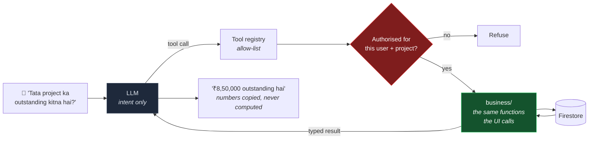

# AI Architecture

Spec §57 step 10, and §30–§34, §51–§52.

**Status: designed now, built in Phase 12.** ADR-002 defers it, for a reason worth restating
— a browser-shipped provider key is readable by anyone who opens devtools, and §47 says stop
and document rather than leak. So the seam is designed and the code is not written.

Nothing here is speculative architecture for its own sake. Getting the *shape* right now
costs nothing and prevents Phases 1–11 from growing code paths the assistant cannot reach.

---

## 1. The one idea

The AI never touches the database, and it never does arithmetic.



The model classifies intent and phrases a reply. Every number in that reply came out of
`packages/shared/src/business` — the identical function the dashboard calls. **The assistant
is arithmetically incapable of disagreeing with the screen**, which is what §51 and §52 are
actually asking for. Not a prompt instructing the model to be careful with figures; a
structure in which inventing one is impossible.

---

## 2. Tool registry

```ts
interface AiTool<P, R> {
  name: string
  description: string
  params: ZodSchema<P>
  requiredRoles: Role[]
  projectScoped: boolean
  mutating: false                       // read tools only — see §4
  execute(params: P, ctx: AuthContext): Promise<R>
}
```

Read tools, from §31:

| Tool | Returns |
|---|---|
| `getProjects` | id, name, client, status — no financials for SUPERVISOR |
| `getProjectDetails` | header + contract value |
| `getProjectFinancialSummary` | the summary document, **all three R-01 quantities separately** |
| `getClientOutstanding` | receivable and unbilled balance, labelled distinctly |
| `getClientPaymentHistory` | paginated, confirmed only |
| `getTodayAttendance` | present / absent / half-day counts and names |
| `getLabourPayable` | earned, paid, payable per labourer |
| `getLabourPaymentHistory` | paginated |
| `getMonthlyMeasurements` | approved measurements for a period |
| `getBillDetails` | a bill and its frozen line items |
| `getProjectExpenses` | grouped by category |
| `getCashFlow` | in / out by period |

Every one is an allow-listed function with a Zod-validated signature. The model **cannot
construct a query** (§31) — it selects a tool by name and supplies typed parameters, and
anything else is rejected before execution.

Authorisation is enforced at the tool boundary against the same role matrix as the UI
(`SECURITY.md` §2), then again by Security Rules underneath. A supervisor asking "Tata
project ka outstanding kitna hai?" is refused at the tool layer, because a natural-language
interface must not become a privilege-escalation path.

---

## 3. Grounding

The model receives tool results and nothing else. No database dump, no schema, no
free-ranging context.

If a tool returns empty, the required answer is that the information is not available —
§52, and non-negotiable. A plausible-sounding guess about how much money a client owes is
the single worst output this system could produce, and it is worse than an error message
precisely because it looks like an answer.

Every response carries provenance: which tools ran, and `summary.computedAt` so a stale
summary (R-04) is visible rather than silently authoritative.

---

## 4. Writes require confirmation — §32

Write tools do not exist. There is no code path by which the model writes to Firestore.

Instead, a write-intent tool returns a **proposal**:

```ts
interface WriteProposal {
  kind: 'LABOUR_PAYMENT' | 'EXPENSE' | 'ATTENDANCE_MARK'
  summary: { en: string; hi: string }
  payload: unknown              // validated against the same Zod schema the form uses
  warnings: string[]            // "exceeds payable amount by ₹2,000"
}
```

The UI renders it as the ordinary confirmation dialog — the same component the manual form
uses, with the same validation:

> Ramesh ke liye ₹8,000 ka payment record ready hai. Confirm karna chahte hain?
> **[ Confirm ]  [ Cancel ]**

On Confirm, the **application** calls `recordLabourPayment`. The model is not in that path.
It proposed; a human decided; deterministic code executed. §32 calls this mandatory, and the
architecture makes it structural rather than procedural.

---

## 5. Provider adapter

```ts
interface AiProvider {
  complete(input: { messages: Message[]; tools: ToolSchema[]; locale: 'en' | 'hi' }):
    Promise<{ text?: string; toolCalls?: ToolCall[] }>
}
```

Deferring the provider choice costs nothing and keeps options open:

| Option | Requires | Note |
|---|---|---|
| Firebase AI Logic (Gemini) | **Blaze** | Cleanest — App Check-gated, no key in the bundle |
| Cloud Function proxy | **Blaze** | Any provider, key stays server-side |
| Direct browser call | — | ✗ **Rejected.** Leaks the key. §47 |

Two of three need Blaze; the third is unacceptable. That is the whole of ADR-002's AI
deferral in one table.

---

## 6. Language — §29, §33

Hindi, English, and **Hinglish**, which is what §33's examples actually are: Hindi grammar
with English nouns. *"Tata project mein kitna paisa baaki hai?"* is neither `hi-IN` nor
`en-IN` cleanly, and it is the realistic input.

Intent classification therefore runs language-agnostically, on the whole utterance, rather
than after a detect-then-translate step that would mangle proper nouns like "Stonede",
"BOQ", or labour names. Responses match the language of the question. Numbers always render
in Indian grouping (₹8,50,000) in both languages, because that is how the figure is spoken
either way.

**R-01 surfaces directly here.** When your father asks *"kitna baaki hai?"*, the answer
depends on whether he means invoiced-and-unpaid or contract-left-to-bill. Until that is
settled, the assistant states both:

> Tata Project mein ₹8,50,000 abhi bill karna baaki hai. Bill kiye hue amount mein se
> ₹0 outstanding hai.

Slightly wordy, and honest. A single confident number here would be a guess dressed as an
answer.

---

## 7. Voice — Phase 13

Web Speech API for STT and TTS. R-09 is candid about the risk: Chromium-only, network-bound,
and `hi-IN` accuracy on construction vocabulary and proper nouns is unproven.

Phase 13 therefore **opens with a measurement spike**, not a UI. Twenty real phrases spoken
by an actual user, transcribed, and scored. If accuracy is poor we ship a constrained command
grammar rather than open-ended speech, and say so plainly.

Voice is always an accelerator over a fully usable tap interface (§28). No feature is ever
reachable only by speaking — a phone in a noisy Agra construction site is not a reliable
input device, and the product cannot depend on one.

---

## 8. What the AI must never do — §52

| Never | Enforced by |
|---|---|
| Invent a financial figure | All numbers originate in `business/`; empty tool result → "not available" |
| Write a financial record | No write tools exist; proposals require human Confirm |
| Delete anything | No delete path anywhere (ADR-007) |
| Bypass authorisation | Role checks at the tool boundary **and** in Security Rules |
| Read another project's data | `projectScoped` tools validate membership |
| Execute an arbitrary query | Allow-listed tools with Zod-typed parameters only |
| Calculate wages, bills, or totals | §51 — deterministic modules; the model may explain a result, never produce one |

The last row is the one that would be easiest to erode in a hurry — the model *can*
multiply 24 × 700 and would usually get it right. It must not, because "usually" is not a
property a payroll system may have.
