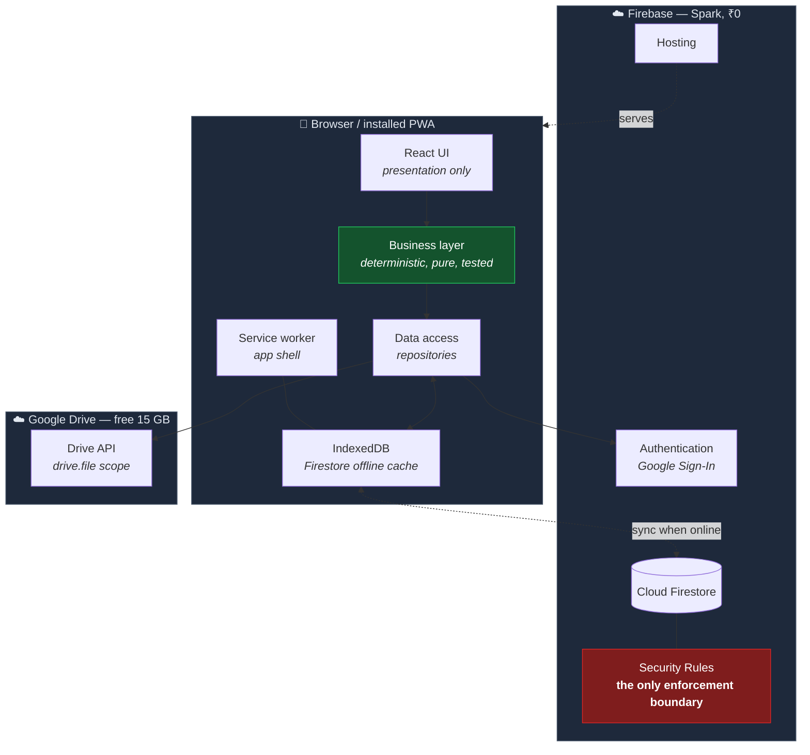
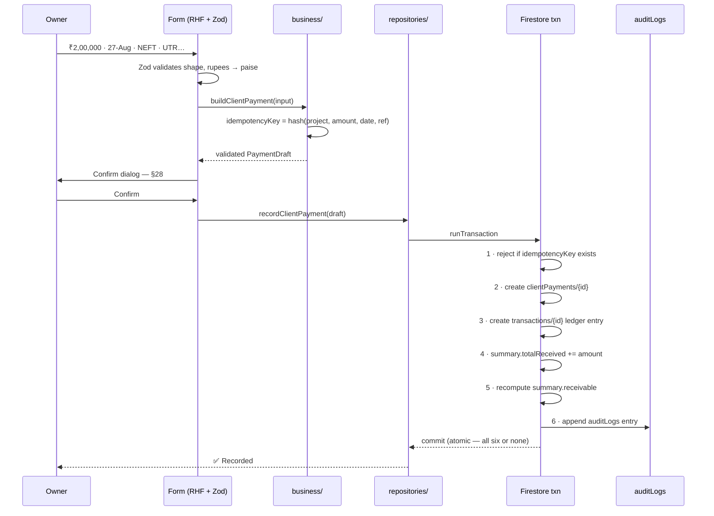

# Architecture

Spec §57 steps 3, 6, 8. Read `DECISIONS.md` first — this document is downstream of it.

---

## 1. The shape of the system

There is no backend. That single fact (ADR-002) explains most of what follows.



Two things to notice. **Security Rules are the only enforcement boundary** — there is no
server-side code to fall back on, so Rules carry the entire weight (R-03). And the
**business layer is pure** — it takes data in and returns numbers out, touching neither
React nor Firestore, which is what makes §51's determinism requirement testable rather than
aspirational.

---

## 2. Stack

| Concern      | Choice                                                    | Why                                                                                       |
| ------------ | --------------------------------------------------------- | ----------------------------------------------------------------------------------------- |
| Language     | TypeScript 5.x, `strict: true`                            | §50 demands strong types. `strict` is non-negotiable in a financial system.               |
| UI           | React 19                                                  | Spec §26.                                                                                 |
| Build        | Vite 6                                                    | Fast, first-class PWA plugin, trivial Firebase Hosting output.                            |
| Styling      | Tailwind CSS 4                                            | Spec §26. Large-touch-target utilities suit §28.                                          |
| Routing      | React Router 7                                            | Data-router mode for route-level auth guards.                                             |
| Server state | TanStack Query 5                                          | Caching, retries, and offline mutation queueing — the hard parts of R-02, solved.         |
| Client state | Zustand                                                   | Tiny. Only locale, auth session, and UI shell state.                                      |
| Forms        | React Hook Form + Zod                                     | Zod schemas live in `packages/validation` and are shared with tests and Rules generation. |
| i18n         | i18next + react-i18next                                   | §29. `en` and `hi` JSON, keys never literals.                                             |
| Dates        | date-fns + date-fns-tz                                    | IST anchoring (R-12).                                                                     |
| PDF          | pdfmake                                                   | Client-side, no server. §36. English-only in v1 (R-08).                                   |
| Charts       | Recharts                                                  | Reports (§37). Lazy-loaded.                                                               |
| Tests        | Vitest + Testing Library + `@firebase/rules-unit-testing` | §42.                                                                                      |
| Monorepo     | npm workspaces                                            | ADR-008.                                                                                  |

**Deliberately excluded:** Redux (overkill), any component library (§28 wants large, plain,
obvious controls, and MUI/Chakra fight that while inflating the bundle), any ORM, and any
paid service (§54).

---

## 3. Repository layout

```
Matrix_Const/
├─ apps/
│  ├─ web/                        # React + Vite PWA — the v1 product
│  │  ├─ src/
│  │  │  ├─ app/                  # router, providers, error boundaries, shell
│  │  │  ├─ features/             # one folder per domain, vertically sliced
│  │  │  │  ├─ auth/  clients/  projects/  boq/  measurements/
│  │  │  │  ├─ bills/  payments/  labour/  attendance/  wages/
│  │  │  │  └─ expenses/  reports/  settings/  assistant/
│  │  │  ├─ components/           # cross-feature primitives (Button, Money, DateField)
│  │  │  ├─ hooks/  lib/  locales/{en,hi}/
│  │  └─ public/                  # manifest.webmanifest, icons
│  └─ mobile/                     # RESERVED — Expo. Empty until ADR-001 is revisited.
│
├─ packages/
│  ├─ types/                      # entity interfaces + enums. Zero dependencies.
│  ├─ validation/                 # Zod schemas. Depends only on types.
│  ├─ shared/                     # THE BUSINESS LAYER
│  │  └─ src/
│  │     ├─ money/                # paise arithmetic, formatting, rounding (ADR-004)
│  │     ├─ datetime/             # IST anchoring, dateKey, periods (R-12)
│  │     ├─ business/             # ← §51 lives here. Pure. Deterministic. Heavily tested.
│  │     │  ├─ boqCalculator.ts        measurementValidator.ts
│  │     │  ├─ billCalculator.ts       wageCalculator.ts
│  │     │  ├─ labourLedger.ts         projectSummary.ts
│  │     │  └─ outstanding.ts          # the three distinct definitions from R-01
│  │     ├─ repositories/         # the ONLY place Firestore is imported
│  │     ├─ storage/              # StorageAdapter + GoogleDriveAdapter (ADR-009)
│  │     ├─ audit/                # append-only audit writer
│  │     └─ ai/                   # tool registry — designed Phase 0, built Phase 12
│  └─ config/                     # shared tsconfig, eslint, prettier
│
├─ firebase/
│  ├─ firestore.rules             # production code. Tested.
│  ├─ firestore.indexes.json
│  └─ seed/                       # emulator seed data
│
├─ docs/                          # you are here
└─ .github/workflows/             # CI (§48)
```

---

## 4. Layering, and the one rule that matters

```
UI  →  business  →  repositories  →  Firestore
```

Dependencies point right. Nothing points back left.

**`packages/shared/src/business` may not import React, Firebase, or any repository.** It
receives plain data and returns plain data. This is what §50 and §51 are really asking for,
and it has three practical payoffs: the twelve critical business tests in §42 run in
milliseconds with no emulator; the same calculation cannot drift between the web app and a
future Expo app; and the AI tool layer (Phase 12) calls the identical functions the UI does,
so the assistant is arithmetically incapable of disagreeing with the screen.

The inverse, stated the way §50 does:

```ts
// ✗ Wrong — component computes money
const wage = present * rate + halfDays * rate * 0.5

// ✓ Right — component renders a computed result
const wage = calculateWage({ attendance, dailyRatePaise, rules })
```

Enforced by ESLint `no-restricted-imports` on the `business` directory, so this is a build
failure rather than a code-review opinion.

---

## 5. How a financial write actually flows

Recording a client payment, end to end:



Six writes, one atomic commit. The idempotency check inside the transaction is what makes a
double-tap or a retry harmless (§42 test 10). Offline, this transaction **fails loudly** —
see below.

---

## 6. Offline

§13 is emphatic: do not lose attendance to a network failure. But Firestore transactions
require a connection (R-02), so writes are split by tolerance.

| Class                 | Offline behaviour                   | Why                                                                       |
| --------------------- | ----------------------------------- | ------------------------------------------------------------------------- |
| **Reads**             | Served from IndexedDB cache         | `persistentLocalCache` with multi-tab manager                             |
| **Attendance writes** | ✅ Queued, sync on reconnect        | Plain `setDoc`, deterministic ID (ADR-006) makes replay idempotent        |
| **Financial writes**  | ❌ Blocked with a clear message     | Cannot be made atomic offline. Better to refuse than to appear to succeed |
| **File uploads**      | ❌ Deferred; the record still saves | An attachment must never fail a payment (ADR-009)                         |

The attendance screen is built to be the _only_ screen a supervisor needs with no signal: a
project's labour roster is prefetched and cached on first load, so marking works from a
cold, offline start. A persistent header shows `Online` / `Offline — N pending`, and the
count only clears on confirmed server acknowledgement.

Sync conflicts resolve last-write-wins on the deterministic document ID, which is correct
here: two supervisors marking the same labourer on the same day is a data-entry duplicate,
not a merge problem. Every overwrite lands in `auditLogs` with both values, so the
disagreement is visible after the fact.

---

## 7. Reading data without burning the quota

§53 and R-10 both point the same way, and the discipline is simple:

- **Dashboards read summary documents, never raw collections.** One document read per
  project card instead of hundreds.
- **Every query is bounded** — `where` + `orderBy` + `limit`. No collection is ever fetched
  whole.
- **`onSnapshot` is reserved** for the attendance screen and the offline-status indicator.
  Everything else is a one-shot `getDocs` cached by TanStack Query. Listeners are the
  easiest way to accidentally spend 50,000 reads.
- **Lists paginate** at 25 with cursor-based `startAfter`.
- A dev-mode read/write counter renders in Settings → Usage (§54), so an accidental
  unbounded listener shows up immediately rather than at midnight.

---

## 8. Internationalisation

§29 says translation keys from day one, and that is easier to hold from the start than to
retrofit. `t('attendance.markPresent')`, never a literal string in a component. ESLint
`react/jsx-no-literals` keeps it honest.

`en` is the fallback; `hi` is Devanagari (A8). Money always formats with Indian digit
grouping in both locales — `₹18,50,000`, not `₹1,850,000` — because that is how the number
is read aloud in either language. Preference persists to `users/{uid}.locale` and to
`localStorage` so the choice survives a signed-out reload.

---

## 9. PWA

`vite-plugin-pwa` with Workbox. App shell precached; Firestore data is _not_ cached by the
service worker — Firestore's own IndexedDB layer owns that, and duplicating it causes stale
reads. Manifest is `display: standalone`, portrait, with maskable icons. An in-app "Install
on this phone" prompt appears for supervisors, since Chrome's own prompt is easy to miss.

---

## 10. Where the AI will attach

Phase 12+, deferred by ADR-002 — but the seam exists now. `packages/shared/src/ai` defines
the tool registry against the same business functions the UI uses, so when a provider is
chosen the assistant reads real numbers through real code paths and cannot invent figures
(§52). Details in `AI_ARCHITECTURE.md`.

---

## 11. Error handling, loading, empty states

§59 counts a feature incomplete without these, so they are shell-level rather than
per-screen: a route-level error boundary with a "Report" action that copies diagnostics; a
shared `<AsyncBoundary>` wrapping every data view with skeleton and empty renderers;
`<EmptyState>` with an explicit call to action ("No measurements yet — Add the first one");
and toast plus inline field errors on mutations, never a silent failure.

Financial actions additionally require a confirm dialog stating the amount in words and
figures (§28) before the write.
