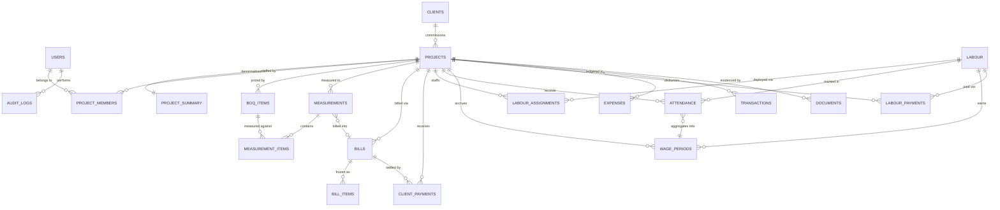

# Firestore Data Model

Spec §57 steps 4 and 5, and §23.

**Conventions throughout.** Money is an integer count of **paise** (ADR-004); a field named
`…Paise` is always an integer, never a float. Dates that identify a day are `dateKey`
strings, `YYYY-MM-DD`, computed in Asia/Kolkata (R-12). Timestamps are Firestore
`Timestamp`, written with `serverTimestamp()`. Periods are `YYYY-MM`. Every document carries
`createdAt`, `createdBy`, `updatedAt`, `updatedBy`.

---

## Entity relationships

Two relationships carry most of the design's weight.

**`LABOUR ↛ PROJECTS` directly.** A labourer reaches a project only through
`LABOUR_ASSIGNMENTS`, exactly as §11 requires. Storing `projectId` on the labour document
would destroy history the moment Ramesh moved sites.

**`MEASUREMENTS }o--o| BILLS` is optional on both sides.** A measurement can be approved but
unbilled; a bill draft exists before it is linked. This is what keeps *billed* and *measured*
as separate quantities — the distinction R-01 is about.

---

## Collections

### `users/{uid}`
uid is the Firebase Auth UID.

| Field | Type | Notes |
|---|---|---|
| `displayName`, `email`, `photoUrl` | string | from Google Sign-In |
| `phone` | string? | |
| `role` | enum | `OWNER \| ADMIN \| SUPERVISOR \| ACCOUNTANT \| VIEWER` — ADR-005 |
| `status` | enum | `ACTIVE \| DISABLED` |
| `locale` | enum | `en \| hi` |
| `driveFolderId` | string? | the shared Drive folder this user can write to |

`role` is writable only by OWNER, and **never** by the user themselves — a rule with teeth,
since a self-role-write is full privilege escalation (R-03).

### `clients/{clientId}`
`name`, `contactPerson`, `phone`, `email`, `billingAddress`, `city`, `state`, `stateCode`
(for future IGST determination), `gstin?`, `status: ACTIVE|INACTIVE`, `notes`.

### `projects/{projectId}`

| Field | Type | Notes |
|---|---|---|
| `name`, `code` | string | e.g. `Tata Project Limited - Agra`, `TPL-AGR` |
| `clientId` | ref | |
| `clientName` | string | denormalised for list rendering without an N+1 read |
| `siteAddress`, `city`, `state` | string | |
| `contractValuePaise` | int | §3 — the agreed contract, not a derived figure |
| `startDate`, `expectedEndDate` | dateKey | |
| `status` | enum | `PLANNING \| ACTIVE \| ON_HOLD \| COMPLETED \| CLOSED` |
| `taxProfile` | map | `{ mode, cgstRate, sgstRate, igstRate, tdsRate, retentionRate }` — ADR-003, all zero by default |
| `wageRules` | map | overrides `settings/app` per project (A4) |

### `projects/{projectId}/summary/current`
One document per project. **This is what dashboards read** (§23, R-10) — never the raw
collections.

| Field | Derivation |
|---|---|
| `contractValuePaise` | copied from the project |
| `totalBilledPaise` | Σ non-cancelled bills `netAmount` |
| `totalReceivedPaise` | Σ confirmed client payments |
| `receivablePaise` | `totalBilled − totalReceived` ← **money owed now** |
| `unbilledBalancePaise` | `contractValue − totalBilled` ← **work left to bill** |
| `approvedMeasuredPaise` | Σ approved measurements |
| `labourEarnedPaise` | Σ locked wage periods |
| `labourPaidPaise` | Σ confirmed labour payments |
| `labourPayablePaise` | `labourEarned − labourPaid` |
| `otherExpensesPaise` | Σ expenses excluding category `LABOUR` |
| `cashOutPaise` | `labourPaid + otherExpenses` |
| `netPositionPaise` | `totalReceived − cashOut` — cash position, **not profit** (§17) |
| `computedAt`, `computedBy`, `schemaVersion` | drift detection (R-04) |

The three separate receivable-style fields are the direct resolution of R-01. Nothing here
is ever called *profit*: §17 forbids that unless all costs are captured, and they are not.

### `projectMembers/{projectId}_{uid}`
Composite ID so Security Rules can check membership with a single `exists()` and no query.
Fields: `projectId`, `uid`, `projectRole`, `addedBy`, `addedAt`.

### `boqItems/{boqItemId}`

| Field | Type | Notes |
|---|---|---|
| `projectId`, `code`, `name`, `description` | | |
| `unit` | enum | `SQFT \| SQM \| RMT \| NOS \| KG \| MT \| CUM \| LS \| DAY` |
| `contractQty` | number | ≤ 3 decimals |
| `ratePaise` | int | |
| `contractAmountPaise` | int | `round(contractQty × ratePaise)` |
| `completedQty` | number | **only mutated inside a measurement-approval transaction** (R-13) |
| `billedQty` | number | only mutated at bill generation |
| `hsnSac` | string? | ADR-003 |
| `sortOrder`, `status` | | `ACTIVE \| CLOSED` |

`completedQty` is the contended field in the whole schema. §4's overbilling rule is enforced
against its *live* value at approval time, never against the value a draft was typed
against.

### `measurements/{measurementId}` + subcollection `items/{itemId}`
Header: `projectId`, `period` (`YYYY-MM`), `date`, `title`, `status`
(`DRAFT | SUBMITTED | APPROVED | REJECTED`), `totalAmountPaise`, `enteredBy`, `submittedAt`,
`approvedBy`, `approvedAt`, `rejectionReason`, `billId?`.

Item: `boqItemId`, `boqItemName`, `location` (e.g. `Block A`), `description`, `unit`,
`ratePaise`, `previousQty` (snapshot at approval), `currentQty`, `totalQty`, `amountPaise`,
`isChangeOrder`, `changeOrderApprovedBy`.

Items are a **subcollection**, not the top-level `measurementItems` of §23 — a deliberate
deviation. A measurement and its lines are approved as one atomic unit, and a subcollection
lets a single batch write them together. Cross-measurement queries ("everything measured
against this BOQ item") use a `collectionGroup` index, which costs one index and no
denormalisation.

Only `APPROVED` measurements are billable (§6).

### `bills/{billId}` + subcollection `items/{itemId}`
`projectId`, `clientId`, `billNumber` (A7, allocated at generation not at draft — R-11),
`billDate`, `periodFrom`, `periodTo`, `measurementIds[]`, `subtotalPaise`, `tax{…}`,
`deductions{…}` (ADR-003), `netAmountPaise`, `amountReceivedPaise`, `status`
(`DRAFT | GENERATED | SENT | PARTIALLY_PAID | PAID | CANCELLED`), `pdfDocumentId?`,
`cancelledBy`, `cancellationReason`.

Bill items are a **frozen snapshot** — name, unit, rate, and quantity copied at generation.
A later BOQ rate change must never retroactively alter an issued bill. Deletion is denied to
every role (ADR-007); `CANCELLED` plus a reversing ledger entry is the only correction.

### `clientPayments/{paymentId}`
`projectId`, `clientId`, `billId?`, `amountPaise`, `date`, `method`
(`NEFT | RTGS | IMPS | UPI | CHEQUE | CASH | OTHER`), `bankReference`, `transactionId`,
`source` (`MANUAL | STATEMENT_IMPORT | SCREENSHOT_OCR`), `documentId?`, `status`
(`PENDING | SUGGESTED | CONFIRMED | REJECTED | REVERSED`), `idempotencyKey`, `notes`,
`confirmedBy`, `confirmedAt`.

Only `CONFIRMED` payments count toward `totalReceived`. AI- or import-derived rows enter as
`SUGGESTED` and require a human transition (§9, §34) — the rule that keeps an OCR misread
out of the books.

### `labour/{labourId}`
`name`, `phone`, `role` (`MASON | HELPER | CARPENTER | ELECTRICIAN | PLUMBER | PAINTER |
SUPERVISOR | OTHER`), `skillLevel`, `defaultDailyWagePaise`, `overtimeHourlyPaise?`,
`status`, `joiningDate`, `notes`.

No Aadhaar, no ID documents, no photograph. §10 says avoid unnecessary sensitive data, and
this system has no reason to hold it.

### `labourAssignments/{assignmentId}`
`labourId`, `labourName` (denormalised), `projectId`, `startDate`, `endDate?`,
`dailyRatePaise` (project-specific, overriding the default), `status`. §11.

### `attendance/{projectId}_{labourId}_{dateKey}`
Deterministic ID — ADR-006. This is the offline-critical collection.

`projectId`, `labourId`, `labourName`, `dateKey`, `status`
(`PRESENT | ABSENT | HALF_DAY | LEAVE | HOLIDAY`), `hours?`, `dailyRatePaise` (snapshot at
marking), `payableUnits` (computed: 1 / 0 / 0.5 / per rules), `markedBy`, `markedAt`
(server), `clientCreatedAt` (device — for skew detection, R-12), `syncSource`
(`ONLINE | OFFLINE_SYNC`), `editedBy?`, `editReason?`, `wagePeriodId?`.

The rate is **snapshotted at marking**. Raising a labourer's wage next month must not
silently repay last month.

### `wagePeriods/{wagePeriodId}`
`projectId`, `labourId`, `periodFrom`, `periodTo`, `presentDays`, `halfDays`, `absentDays`,
`leaveDays`, `payableDays`, `dailyRatePaise`, `earnedAmountPaise`, `status`
(`DRAFT | LOCKED`), `computedAt`, `computedBy`, `lockedAt`.

Computed by the deterministic `wageCalculator` (§14, §51) — never by AI. Locking freezes the
figures and is what promotes them into `summary.labourEarnedPaise`.

### `labourPayments/{paymentId}`
`labourId`, `labourName`, `projectId`, `wagePeriodId?`, `amountPaise`, `date`, `method`
(`PHONEPE | CASH | BANK_TRANSFER | OTHER`), `phonepeTransactionId?`, `bankTransactionId?`,
`documentId?`, `status` (`PENDING | CONFIRMED | REVERSED`), `idempotencyKey`, `notes`.

Records payments; never initiates them (§15).

### `expenses/{expenseId}`
`projectId`, `category` (`LABOUR | MATERIAL | TRANSPORT | EQUIPMENT | FOOD | ACCOMMODATION |
MISC | OTHER`), `amountPaise`, `date`, `description`, `paymentMethod`, `documentId?`,
`status` (`RECORDED | REVERSED`), `vendorName?`.

`LABOUR`-category expenses are excluded from `otherExpensesPaise` to avoid double-counting
against `labourPaidPaise`.

### `transactions/{transactionId}` — the ledger
Every financial event, in one place (§18).

`projectId`, `type` (`BILL | CLIENT_PAYMENT | LABOUR_PAYMENT | EXPENSE | ADJUSTMENT |
REVERSAL`), `direction` (`IN | OUT | ACCRUAL`), `amountPaise`, `date`, `refType`, `refId`,
`description`, `status` (`ACTIVE | REVERSED`), `reversalOf?`, `createdBy`, `createdAt`.

Append-only. A correction is a new opposing entry referencing the original — never an edit
(ADR-007). The ledger is the reconciliation source for R-04.

### `documents/{documentId}`
Storage-agnostic metadata (ADR-009): `projectId`, `kind` (`QUOTATION | MEASUREMENT_SHEET |
BILL_PDF | PAYMENT_PROOF | EXPENSE_RECEIPT | BANK_STATEMENT | OTHER`), `provider`
(`GOOGLE_DRIVE | FIREBASE_STORAGE`), `externalId` (Drive file ID or Storage path),
`fileName`, `mimeType`, `sizeBytes`, `uploadedBy`, `uploadedAt`, `linkedRefType`,
`linkedRefId`, `status` (`AVAILABLE | MISSING | DELETED`).

`MISSING` matters: R-06 means a file can vanish with a departed Google account while the
metadata survives. The app shows "attachment unavailable" rather than a broken link.

### `auditLogs/{logId}`
`userId`, `userName`, `action`, `entityType`, `entityId`, `projectId?`, `before?`, `after?`,
`reason?`, `at` (server). Create-only for every role including OWNER (§19, ADR-007).

### `counters/{counterId}`, `settings/app`, `notifications/{id}`
`counters` — e.g. `billNumber_2025-26`, holding `{ current }`, incremented transactionally
(R-11). `settings/app` — business profile, wage rules (A4), attendance rules, bill numbering
(A7), Drive folder ID; OWNER-writable, all-authenticated-readable. `notifications` — modelled
now, delivered in-app only until Blaze (R-14).

---

## Summary maintenance

Every financial write updates `summary/current` inside the same transaction that writes the
entity — the six-step commit in `ARCHITECTURE.md` §5. Since there are no Cloud Functions
(ADR-002), this is client-side, and therefore it can drift (R-04).

The safety net is `recomputeProjectSummary(projectId)`: it re-derives every field from source
documents, and it is the **authoritative definition** — the transactional increments are an
optimisation over it, and the two are checked against each other in tests. It runs from
Settings → Reconciliation for OWNER, shows a before/after diff, and writes to `auditLogs`. A
dashboard banner appears when `summary.computedAt` predates the project's newest financial
write.

Presented as a button someone presses, never as automatic self-healing.

---

## Denormalisation

`clientName` on projects, `labourName` on attendance and assignments, and `boqItemName` on
measurement items exist to keep list rendering to one read (R-10). They are written once at
creation and refreshed by an OWNER-run maintenance routine on rename — accepted staleness,
since these names change rarely and nothing financial depends on them.

Frozen snapshots are a different thing and must not be "fixed" by that routine: `ratePaise`
on attendance and on bill items are historical facts, deliberately immutable.

---

## Composite indexes

Declared in `firebase/firestore.indexes.json`. The set the queries actually need:

| Collection | Fields |
|---|---|
| `attendance` | `projectId` ASC, `dateKey` DESC |
| `attendance` | `labourId` ASC, `dateKey` DESC |
| `measurements` | `projectId` ASC, `status` ASC, `period` DESC |
| `bills` | `projectId` ASC, `status` ASC, `billDate` DESC |
| `clientPayments` | `projectId` ASC, `status` ASC, `date` DESC |
| `clientPayments` | `clientId` ASC, `date` DESC |
| `labourPayments` | `labourId` ASC, `date` DESC |
| `expenses` | `projectId` ASC, `category` ASC, `date` DESC |
| `transactions` | `projectId` ASC, `date` DESC |
| `auditLogs` | `entityType` ASC, `entityId` ASC, `at` DESC |
| `measurements/items` (group) | `boqItemId` ASC, `createdAt` DESC |

---

## What is deliberately *not* modelled in v1

Materials inventory, purchase orders, vendor ledgers, equipment tracking, subcontractor
chains, and multi-company support. Each is a coherent feature and none is in the spec. Named
here so their absence is a decision on record rather than an oversight.
